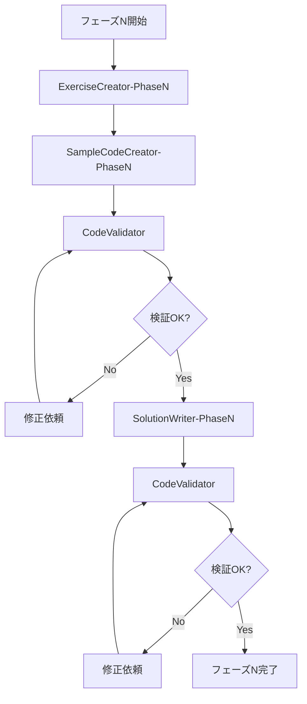

# AI Agent タスク管理ドキュメント

## 📋 プロジェクト概要

このドキュメントは、Lean言語学習プロジェクトにおけるAI agentのタスク分割と協調作業の指針を定義します。

**プロジェクト目標**: Mathematics in Leanを基にした体系的学習教材の作成

**現在の状態**:
- ✅ プロジェクト構造の確立
- ✅ ロードマップの策定（6フェーズ）
- ✅ フェーズ1の初期演習問題（2問）
- ⏳ フェーズ2-6の演習問題作成待ち

---

## 🎯 AI Agentタスク分割戦略

### 全体アーキテクチャ

```
┌─────────────────────────────────────────────────────────┐
│              Master Agent (指揮・統括)                    │
│  - タスクの優先順位付け                                    │
│  - 成果物の品質チェック                                    │
│  - 進捗管理                                               │
└─────────────────────────────────────────────────────────┘
                        │
        ┌───────────────┼───────────────┐
        │               │               │
┌───────▼──────┐ ┌──────▼──────┐ ┌──────▼──────┐
│  Exercise    │ │   Sample    │ │  Solution   │
│  Creator     │ │   Code      │ │  Writer     │
│  Agents      │ │   Agent     │ │  Agent      │
│ (並列実行)    │ │             │ │             │
└──────────────┘ └─────────────┘ └─────────────┘
        │               │               │
        └───────────────┼───────────────┘
                        │
            ┌───────────▼───────────┐
            │   Validator Agent     │
            │  (コード検証・テスト)   │
            └───────────────────────┘
```

---

## 🤖 Agent種別と役割

### 1. Exercise Creator Agents（演習問題作成Agent）

**役割**: 各フェーズの演習問題を作成

**実行モード**: フェーズ別に並列実行可能

**タスク詳細**:

#### Agent: ExerciseCreator-Phase{N}
- **入力**: 
  - `docs/02_roadmap.md`の該当フェーズ部分
  - 既存の演習問題パターン
- **出力**: 
  - `exercises/phase{N}/exercise{M}.lean`ファイル
  - `exercises/phase{N}/README.md`の更新
- **制約**:
  - 基礎問題は必須、応用問題は段階的に難易度設定
  - 各問題に適切なコメントとTODOマーカーを含める
  - 既存の問題と重複しない

**タスクテンプレート**:
```markdown
## タスク: フェーズ{N}の演習問題作成

**対象フェーズ**: Phase {N} - {フェーズ名}
**問題数**: 基礎問題{X}問 + 応用問題{Y}問
**参考**: docs/02_roadmap.md の該当セクション

### 作業手順:
1. ロードマップから学習内容とKGIを確認
2. 基礎問題を{N}問作成（段階的難易度）
3. 応用問題を{Y}問作成
4. 各問題ファイルに適切なコメントを追加
5. exercises/phase{N}/README.mdを更新
6. 作成した問題をリスト化して報告

### 出力ファイル例:
- exercises/phase{N}/exercise1.lean
- exercises/phase{N}/exercise2.lean
- exercises/phase{N}/exercise3.lean
- exercises/phase{N}/README.md（更新）
```

**優先順位**: Phase 1 > Phase 2 > Phase 3 > Phase 4 > Phase 5 > Phase 6

---

### 2. Sample Code Agent（サンプルコード作成Agent）

**役割**: 学習を支援する参考サンプルコードの作成

**実行モード**: フェーズと独立して実行可能

**タスク詳細**:

#### Agent: SampleCodeCreator
- **入力**: 
  - 各フェーズの学習内容
  - 既存のサンプルコード
- **出力**: 
  - `examples/{category}/{filename}.lean`
  - `examples/README.md`の更新
- **カテゴリ分類**:
  - `basic/`: 基本構文の例
  - `proofs/`: 証明のパターン例
  - `math/`: 数学的概念の形式化例
  - `advanced/`: 高度な技法の例

**タスクテンプレート**:
```markdown
## タスク: フェーズ{N}向けサンプルコード作成

**対象**: Phase {N}の学習内容
**カテゴリ**: {basic|proofs|math|advanced}
**作成数**: {X}個のサンプル

### 作業手順:
1. フェーズ{N}の学習内容を分析
2. 学習者がつまずきやすいポイントを特定
3. 段階的なサンプルコードを作成（簡単→複雑）
4. 各サンプルに詳細なコメントを追加
5. examples/README.mdを更新

### サンプルコード要件:
- コメントで説明が十分
- 実行可能でエラーがない
- 段階的な理解が可能
```

**優先順位**: Phase 1 > Phase 2 > Phase 3 > ...

---

### 3. Solution Writer Agent（解答・解説作成Agent）

**役割**: 演習問題の解答と解説の作成

**実行モード**: 演習問題作成後に実行

**タスク詳細**:

#### Agent: SolutionWriter-Phase{N}
- **入力**: 
  - `exercises/phase{N}/exercise*.lean`
  - ロードマップの該当セクション
- **出力**: 
  - `exercises/phase{N}/solutions/solution{M}.lean`
  - `exercises/phase{N}/solutions/README.md`
  - `exercises/phase{N}/solutions/explanations.md`
- **制約**:
  - 解答コードは完全に動作すること
  - 解説には「なぜその方法か」を含める
  - 複数の解法がある場合は複数提示

**タスクテンプレート**:
```markdown
## タスク: フェーズ{N}の解答・解説作成

**対象**: exercises/phase{N}/内の全演習問題
**出力場所**: exercises/phase{N}/solutions/

### 作業手順:
1. exercises/phase{N}/内の全問題を確認
2. 各問題の解答を実装
3. 解答コードを動作確認
4. 詳細な解説ドキュメントを作成
5. solutions/README.mdに索引を作成

### 出力要件:
- 解答コード: 動作確認済み、コメント付き
- 解説: 思考プロセス、よくある間違い、発展的内容
```

**優先順位**: Phase 1 > Phase 2 > ...

---

### 4. Validator Agent（検証Agent）

**役割**: 作成されたコードの検証と品質チェック

**実行モード**: 各Agentの出力後に実行

**タスク詳細**:

#### Agent: CodeValidator
- **入力**: 新規作成・更新された`.lean`ファイル
- **出力**: 
  - 検証レポート（`validation/reports/`）
  - エラー修正提案
- **チェック項目**:
  - 構文エラーの有無
  - 型エラーの有無
  - コメントの適切性
  - コードスタイルの一貫性
  - ファイル命名規則の遵守

**タスクテンプレート**:
```markdown
## タスク: コード検証

**対象ファイル**: {ファイルパス}
**検証タイプ**: {syntax|type|style|all}

### 検証手順:
1. Leanコンパイラで構文チェック
2. 型チェックの実行
3. コメントの妥当性確認
4. スタイルガイドとの整合性確認
5. 検証レポート生成

### 出力:
- validation/reports/{timestamp}_{filename}.md
```

**実行タイミング**: 各Agentタスク完了後、またはバッチ実行

---

## 📊 タスク実行フロー

### 標準的なフェーズ完了フロー



### 並列実行可能なタスク

以下は同時に実行可能：
- ExerciseCreator-Phase2, Phase3, Phase4, ...（異なるフェーズ）
- SampleCodeCreatorとExerciseCreator（独立作業）
- 異なるフェーズのSolutionWriter

### 順次実行が必要なタスク

以下は前のタスク完了が必要：
- SolutionWriter → ExerciseCreator完了後
- CodeValidator → コード作成後
- フェーズN+1 → フェーズN完了後（推奨）

---

## 🎯 作業優先順位

### Phase 1 (最優先)
- [ ] ExerciseCreator-Phase1: 残りの演習問題（基礎3-5問、応用2-3問）
- [ ] SampleCodeCreator: Phase1向けサンプル（basic/ 3-5個）
- [ ] SolutionWriter-Phase1: 全問題の解答・解説

### Phase 2 (高優先度)
- [ ] ExerciseCreator-Phase2: 全演習問題作成
- [ ] SampleCodeCreator: Phase2向けサンプル
- [ ] SolutionWriter-Phase2: 解答・解説

### Phase 3-6 (順次進行)
- [ ] 各フェーズで同様のパターンで進行

---

## 📝 Agent間の連携プロトコル

### ファイル命名規則

**演習問題**: 
- `exercises/phase{N}/exercise{M}.lean` (Mは連番)
- `exercises/phase{N}/exercise{M}_advanced.lean` (応用問題)

**解答**: 
- `exercises/phase{N}/solutions/solution{M}.lean`
- `exercises/phase{N}/solutions/explanations.md`

**サンプルコード**: 
- `examples/{category}/{description}.lean`
- 例: `examples/basic/pattern_matching.lean`

### コミュニケーション

各Agentは以下を遵守：
1. **出力ファイルのヘッダーコメント**: 作成日、Agent名、目的を記載
2. **変更履歴**: 重要な変更はREADMEに記録
3. **競合回避**: 同じファイルを同時編集しない

### エラーハンドリング

- Agentがエラーを検出した場合、`issues/`ディレクトリに報告
- Master Agentが優先順位を決定
- 再実行または別Agentに再割り当て

---

## 🔍 品質基準

### 演習問題の品質基準

- ✅ 問題文が明確で理解しやすい
- ✅ 段階的な難易度設定
- ✅ 適切なヒントとコメント
- ✅ 解答可能で明確な目標がある
- ✅ 学習目標と整合性がある

### サンプルコードの品質基準

- ✅ コンパイルエラーなし
- ✅ 詳細なコメント
- ✅ 実行可能
- ✅ 教育的価値が高い
- ✅ 段階的な理解が可能

### 解答の品質基準

- ✅ 完全に動作する
- ✅ 複数の解法を提示（可能な場合）
- ✅ 詳細な解説
- ✅ よくある間違いへの言及
- ✅ 発展的な内容へのリンク

---

## 🚀 Agentタスク例

### 例1: Phase1の残り演習問題作成

```markdown
**Agent**: ExerciseCreator-Phase1
**タスク**: Phase1の基礎問題3-5問と応用問題2-3問を作成

**詳細要件**:
1. docs/02_roadmap.md Phase1セクションを参照
2. 既存のexercise1.lean, exercise2.leanと整合性を保つ
3. 問題の流れ: 基本型 → 関数定義 → 文字列操作 → 複数引数 → 条件分岐
4. 各問題に適切なコメントとTODOを配置

**出力**:
- exercises/phase1/exercise3.lean
- exercises/phase1/exercise4.lean  
- exercises/phase1/exercise5.lean
- exercises/phase1/exercise4_advanced.lean
- exercises/phase1/exercise5_advanced.lean
- exercises/phase1/README.md（更新）
```

### 例2: Phase2の全演習作成

```markdown
**Agent**: ExerciseCreator-Phase2
**タスク**: Phase2の全演習問題作成（基礎5問、応用3問）

**詳細要件**:
1. 型システム（依存型、Type階層）
2. パターンマッチング
3. 再帰関数
4. リスト操作
5. ローカル定義

**参考**: docs/02_roadmap.md Phase2セクション
```

---

## 📈 進捗追跡

### 進捗確認コマンド

```bash
# 各フェーズの演習問題数確認
find exercises/ -name "exercise*.lean" | wc -l

# サンプルコード数確認
find examples/ -name "*.lean" | wc -l

# 解答数確認
find exercises/ -path "*/solutions/*.lean" | wc -l
```

### 進捗レポート

各Agent完了時に以下を報告：
- 作成ファイル数
- エラーや課題
- 次のステップの推奨

---

## 🛠️ トラブルシューティング

### よくある問題

1. **コンパイルエラー**
   - Validator Agentが検出
   - エラー箇所を特定して修正指示

2. **問題の重複**
   - 既存問題と比較して重複チェック
   - 必要に応じて統合または差し替え

3. **難易度不整合**
   - ロードマップのKGIと照合
   - 段階的に調整

---

## 📚 参考資料

### 各Agentが参照すべき資料

- **ロードマップ**: `docs/02_roadmap.md`
- **セットアップ**: `docs/01_setup.md`
- **既存問題**: `exercises/phase1/`（パターン参考）
- **サンプル**: `examples/basic/hello.lean`

### 外部リソース

- [Mathematics in Lean](https://leanprover-community.github.io/mathematics_in_lean/)
- [mathlib docs](https://leanprover-community.github.io/mathlib4_docs/)
- [Lean 4 Manual](https://leanprover.github.io/lean4/doc/)

---

## 🎓 Agent育成ガイドライン

### 新規Agentへの指示

1. このAGENT.mdを必ず読む
2. 既存のコードスタイルを確認
3. 小さなタスクから開始
4. Validator Agentのフィードバックを重視
5. エラーはissues/に報告

---

**最終更新**: 2024年
**管理者**: Master Agent / プロジェクトオーナー

